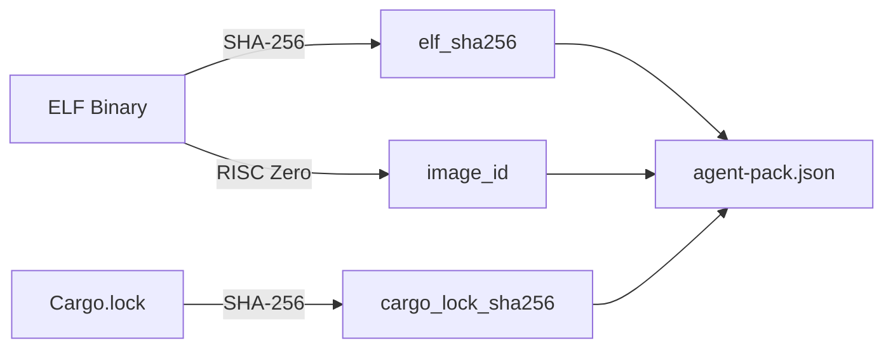

# Publishing Agent Pack Bundles

This guide covers the bundle workflow for distributing verifiable agents to integrators and marketplaces.

## What is a Bundle?

A bundle is a self-contained directory that integrators can verify without any build tools. It contains the manifest and the ELF binary in a portable structure:

```
my-agent-bundle/
├── agent-pack.json      # Manifest with computed hashes
└── artifacts/
    └── zkvm-guest       # The ELF binary
```

## Creating a Bundle

### Prerequisites

Before creating a bundle, ensure you have:
1. A populated manifest (created with `agent-pack init`)
2. A built ELF binary (from `cargo build --release -p risc0-methods`)
3. Optionally, your `Cargo.lock` file

### The Pack Command

```bash
agent-pack pack \
  --manifest dist/agent-pack.json \
  --elf target/riscv-guest/riscv32im-risc0-zkvm-elf/release/zkvm-guest \
  --out my-agent-bundle \
  --cargo-lock Cargo.lock
```

This command:
1. Reads your input manifest
2. Creates the output directory structure
3. Copies the ELF binary to `artifacts/`
4. Computes and updates cryptographic hashes
5. Writes the final manifest with relative paths

### Pack Options

| Option | Default | Description |
|--------|---------|-------------|
| `--manifest` | required | Path to input manifest |
| `--elf` | required | Path to ELF binary |
| `--out` | required | Output directory |
| `--cargo-lock` | none | Path to Cargo.lock |
| `--copy-elf` | true | Copy ELF to bundle |
| `--force` | false | Overwrite existing output |

## What Gets Computed

The pack command recomputes certain fields to ensure the manifest matches the actual binary:



| Field | Source | Notes |
|-------|--------|-------|
| `elf_sha256` | ELF file | Always computed |
| `image_id` | ELF file | Requires `--features risc0` |
| `cargo_lock_sha256` | Cargo.lock | Only if `--cargo-lock` provided |

Fields NOT recomputed by pack:
- `agent_code_hash` - derived from source at build time by `build.rs`
- `agent_name`, `agent_version`, `agent_id` - identity fields
- `inputs`, `actions_profile` - documentation fields

## Verifying a Bundle

Recipients verify the bundle with a single command:

```bash
agent-pack verify \
  --manifest my-agent-bundle/agent-pack.json \
  --base-dir my-agent-bundle
```

The verification:
1. Checks manifest structure is valid
2. Locates ELF at relative path (`artifacts/zkvm-guest`)
3. Recomputes SHA-256 and compares to `elf_sha256`
4. Recomputes imageId if risc0 feature is available

## Complete Workflow

### Step 1: Initialize

```bash
agent-pack init \
  --name my-yield-agent \
  --version 1.0.0 \
  --agent-id 0x0000000000000000000000000000000000000000000000000000000000000042
```

### Step 2: Build

```bash
RISC0_USE_DOCKER=1 cargo build --release -p risc0-methods
```

### Step 3: Edit Metadata

Update `dist/agent-pack.json` with:
- Input format description
- Actions profile
- Network deployment addresses
- Git repository info

### Step 4: Create Bundle

```bash
agent-pack pack \
  --manifest dist/agent-pack.json \
  --elf target/riscv-guest/riscv32im-risc0-zkvm-elf/release/zkvm-guest \
  --out release/my-agent-v1.0.0 \
  --cargo-lock Cargo.lock
```

### Step 5: Verify

```bash
agent-pack verify \
  --manifest release/my-agent-v1.0.0/agent-pack.json \
  --base-dir release/my-agent-v1.0.0
```

### Step 6: Distribute

Ship the entire `release/my-agent-v1.0.0/` directory.

## Hash Stability

Understanding what triggers hash changes helps with versioning:

| Change | agent_code_hash | elf_sha256 | image_id |
|--------|:---------------:|:----------:|:--------:|
| Agent source code | Yes | Yes | Yes |
| SDK version | No | Yes | Yes |
| Rust toolchain | No | Yes | Yes |
| Cargo.lock dependencies | No | Yes | Yes |
| RISC Zero version | No | Yes | Yes |
| Manifest metadata only | No | No | No |

The `agent_code_hash` is the most stable identifier—it only changes when your agent's source files change.

The `image_id` is the most comprehensive—any change to the build environment affects it. This is what gets verified on-chain.

## Tamper Detection

If anyone modifies the ELF binary after bundling, verification will fail:

```bash
# Original bundle passes
$ agent-pack verify --manifest bundle/agent-pack.json --base-dir bundle
Verification PASSED

# Tamper with ELF
$ echo "malicious" >> bundle/artifacts/zkvm-guest

# Verification now fails
$ agent-pack verify --manifest bundle/agent-pack.json --base-dir bundle
Verification FAILED

Errors:
  1. ELF hash mismatch: expected 0xabc..., computed 0xdef...
```

## Marketplace Ingestion

When submitting bundles to marketplaces, or when operating a marketplace that accepts agent submissions, a complete verification workflow includes both offline and on-chain verification.

:::tip Reference Integrator
For a complete integration library that handles bundle loading, verification, proof generation, and on-chain execution, see the [Reference Integrator](/integration/reference-integrator). It provides both a Rust library and CLI tools for marketplace backends.
:::

### Complete Verification Script

```bash
#!/bin/bash
set -e

BUNDLE_DIR="$1"
RPC_URL="${RPC_URL:-https://sepolia.infura.io/v3/YOUR_KEY}"
VERIFIER="0x9Ef5bAB590AFdE8036D57b89ccD2947D4E3b1EFA"

# Step 1: Offline verification
echo "Running offline verification..."
agent-pack verify \
  --manifest "$BUNDLE_DIR/agent-pack.json" \
  --base-dir "$BUNDLE_DIR"

# Step 2: On-chain verification
echo "Running on-chain verification..."
agent-pack verify-onchain \
  --manifest "$BUNDLE_DIR/agent-pack.json" \
  --rpc "$RPC_URL" \
  --verifier "$VERIFIER"

echo "Bundle verified successfully!"
```

:::note
The `verify-onchain` command requires building agent-pack with the `onchain` feature:
```bash
cargo build -p agent-pack --features onchain
```
:::

### Exit Code Handling

The `verify-onchain` command returns structured exit codes for CI integration:

| Exit Code | Action |
|-----------|--------|
| 0 | Accept submission - agent is verified |
| 1 | Retry or investigate - RPC or parsing error |
| 2 | Reject - agent registered with different image_id |
| 3 | Reject - agent not registered on-chain |

## Best Practices

### Version Your Bundles

Include the version in the bundle directory name:

```bash
agent-pack pack \
  --manifest dist/agent-pack.json \
  --elf ... \
  --out releases/yield-agent-v1.0.0
```

### Use Reproducible Builds

Always use Docker for reproducible builds:

```bash
RISC0_USE_DOCKER=1 cargo build --release -p risc0-methods
```

This ensures anyone can reproduce the exact same binary from source.

### Include Git Info

Add git repository and commit to your manifest before packing:

```json
{
  "git": {
    "repository": "https://github.com/your-org/your-agent",
    "commit": "abc123def456..."
  }
}
```

### Verify Before Publishing

Always verify your bundle before distributing:

```bash
agent-pack verify --manifest bundle/agent-pack.json --base-dir bundle
```

## Troubleshooting

### "Output directory already exists"

Use `--force` to overwrite:

```bash
agent-pack pack ... --out existing-dir --force
```

### "ELF file not found"

Check the path to your ELF binary. After building, it's typically at:

```
target/riscv-guest/riscv32im-risc0-zkvm-elf/release/zkvm-guest
```

### "Manifest not found"

Ensure you've run `agent-pack init` first to create the manifest.

### "image_id not computed"

Build agent-pack with the risc0 feature:

```bash
cargo build -p agent-pack --features risc0
```

## Related

- [Agent Pack Format](/agent-pack/format) - Manifest structure
- [Verification](/agent-pack/verification) - Verification details
- [RISC0 Build Pipeline](/guest-program/risc0-build-pipeline) - Building ELF binaries
- [Reference Integrator](/integration/reference-integrator) - Complete integration library for marketplaces
