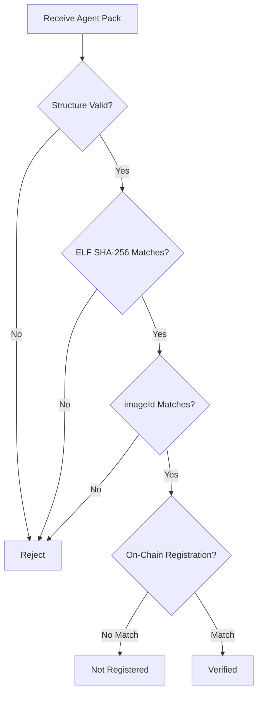

# Agent Pack Verification

This document explains how to verify an Agent Pack's authenticity, both offline and against on-chain registrations.

## Verification Levels



## Structure Verification

Check that the manifest is well-formed:

```bash
agent-pack verify --manifest agent-pack.json --structure-only
```

This validates:
- All required fields present
- Hex strings have correct format (0x prefix, correct length)
- Version strings are valid semver
- No placeholder values remain

### Required Fields

```json
{
  "format_version": "must be '1'",
  "agent_name": "non-empty string",
  "agent_version": "valid semver",
  "agent_id": "0x + 64 hex chars",
  "agent_code_hash": "0x + 64 hex chars",
  "image_id": "0x + 64 hex chars",
  "artifacts": {
    "elf_path": "non-empty string",
    "elf_sha256": "0x + 64 hex chars"
  }
}
```

## ELF Verification

Verify the ELF binary integrity:

```bash
agent-pack verify --manifest agent-pack.json --base-dir ./artifacts
```

This:
1. Locates the ELF file at `{base-dir}/{elf_path}`
2. Computes SHA-256 of the ELF binary
3. Compares to `artifacts.elf_sha256`

```rust
// Verification logic
let elf_bytes = std::fs::read(&elf_path)?;
let computed_hash = sha256(&elf_bytes);

if computed_hash != manifest.artifacts.elf_sha256 {
    return Err("ELF hash mismatch");
}
```

## imageId Verification

Verify the imageId matches the ELF:

```bash
# Requires risc0 feature
agent-pack verify --manifest agent-pack.json --base-dir ./artifacts
```

This:
1. Loads the ELF binary
2. Computes imageId using RISC Zero
3. Compares to manifest `image_id`

:::note
imageId verification requires building with `--features risc0` and having the RISC Zero toolchain installed.
:::

## On-Chain Verification

After offline verification, check the on-chain registration. The `verify-onchain` command provides a simple way to query the KernelExecutionVerifier contract and compare the registered imageId with your manifest.

### Using verify-onchain Command

```bash
agent-pack verify-onchain \
  --manifest agent-pack.json \
  --rpc https://sepolia.infura.io/v3/YOUR_KEY \
  --verifier 0x9Ef5bAB590AFdE8036D57b89ccD2947D4E3b1EFA
```

:::note
The `verify-onchain` command requires building agent-pack with the `onchain` feature:
```bash
cargo build -p agent-pack --features onchain
```
:::

### Exit Codes

The command returns structured exit codes for CI integration:

| Exit Code | Meaning |
|-----------|---------|
| 0 | Agent is registered and image_id matches |
| 1 | Error (RPC failure, invalid manifest, etc.) |
| 2 | Agent is registered but image_id differs |
| 3 | Agent is not registered (agent_id returns zero) |

### Using Cast (Alternative)

You can also verify manually using `cast`:

```bash
export VERIFIER_ADDRESS=0x9Ef5bAB590AFdE8036D57b89ccD2947D4E3b1EFA
export AGENT_ID=0x0000000000000000000000000000000000000000000000000000000000000001

# Query registered imageId
cast call $VERIFIER_ADDRESS "agentImageIds(bytes32)(bytes32)" \
    $AGENT_ID --rpc-url $RPC_URL
```

### Manual Comparison

```bash
# From manifest
MANIFEST_IMAGE_ID=$(jq -r '.image_id' agent-pack.json)

# From chain
CHAIN_IMAGE_ID=$(cast call $VERIFIER_ADDRESS "agentImageIds(bytes32)(bytes32)" $AGENT_ID --rpc-url $RPC_URL)

# Compare
if [ "$MANIFEST_IMAGE_ID" == "$CHAIN_IMAGE_ID" ]; then
    echo "Agent Pack is verified and registered on-chain"
else
    echo "WARNING: imageId mismatch!"
fi
```

### Marketplace Verification Workflow

A complete verification workflow for marketplaces accepting agent submissions:

```bash
#!/bin/bash
set -e

# Step 1: Offline verification - structure and file hashes
agent-pack verify --manifest submission/agent-pack.json --base-dir submission

# Step 2: On-chain verification - confirm registration
agent-pack verify-onchain \
  --manifest submission/agent-pack.json \
  --rpc "$RPC_URL" \
  --verifier 0x9Ef5bAB590AFdE8036D57b89ccD2947D4E3b1EFA

echo "Agent verified successfully!"
```

## Reproducible Verification

For maximum trust, reproduce the build:

### 1. Get Source

```bash
# Clone at specified commit
git clone $(jq -r '.git.repository' agent-pack.json)
cd execution-kernel
git checkout $(jq -r '.git.commit' agent-pack.json)
```

### 2. Verify Cargo.lock

```bash
# Check Cargo.lock hash
EXPECTED=$(jq -r '.build.cargo_lock_sha256' agent-pack.json)
ACTUAL=$(sha256sum Cargo.lock | cut -d' ' -f1)

if [ "0x$ACTUAL" != "$EXPECTED" ]; then
    echo "WARNING: Cargo.lock mismatch - dependencies differ"
fi
```

### 3. Reproduce Build

```bash
# Run the exact build command
$(jq -r '.build.build_command' agent-pack.json)
```

### 4. Compare Artifacts

```bash
# Compare ELF hash
EXPECTED_ELF=$(jq -r '.artifacts.elf_sha256' agent-pack.json)
ACTUAL_ELF=$(sha256sum target/riscv-guest/.../zkvm-guest | cut -d' ' -f1)

if [ "0x$ACTUAL_ELF" == "$EXPECTED_ELF" ]; then
    echo "Build reproduced successfully - artifacts match"
fi
```

## Verification Checklist

### For Integrators

- [ ] Manifest structure is valid
- [ ] ELF SHA-256 matches manifest
- [ ] imageId matches manifest (if risc0 available)
- [ ] imageId is registered on-chain for the agent_id
- [ ] Network deployment info matches target network

### For Auditors

All of the above, plus:
- [ ] Reproduced build from source
- [ ] Cargo.lock hash matches
- [ ] Built ELF produces same elf_sha256
- [ ] Built ELF produces same imageId
- [ ] agent_code_hash appears in journal on-chain

## Error Handling

### "Structure validation failed"

Check for:
- Missing required fields
- Invalid hex strings (missing 0x, wrong length)
- Invalid version strings

### "ELF hash mismatch"

Possible causes:
- Wrong ELF file
- Corrupted download
- Modified binary

### "imageId mismatch"

Possible causes:
- Non-reproducible build used
- Different RISC Zero version
- Different Rust compiler version

### "Not registered on-chain"

The agent may:
- Not be deployed to this network
- Be registered under a different agent_id
- Have been deregistered

## Security Considerations

### Trust Model

Verification establishes:
1. ELF is unmodified (SHA-256 check)
2. imageId matches ELF (RISC Zero computation)
3. imageId is authorized (on-chain registration)

Verification does NOT establish:
- Agent is safe or correct
- Agent won't lose money
- Source code has been audited

### Reproducibility Importance

Without reproducible builds:
- You trust the manifest author
- You can't verify source → binary correspondence

With reproducible builds:
- Anyone can verify the build
- Source code is authoritative

## Related

- [Agent Pack Format](/agent-pack/format) - Manifest structure
- [Manifest Schema](/agent-pack/manifest-schema) - JSON schema
- [On-Chain Verifier](/onchain/verifier-overview) - Contract details
- [Reference Integrator](/integration/reference-integrator) - Complete integration library
