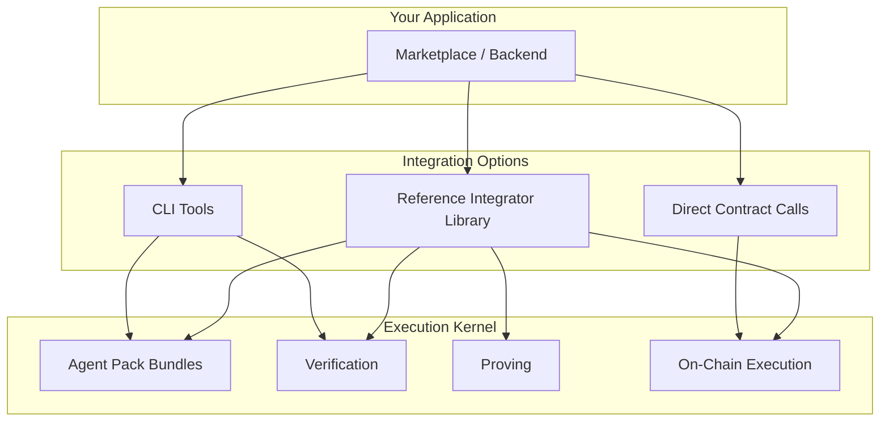

# Integration Guide

This section covers how to integrate the Execution Kernel into your applications, marketplaces, and backend services.

## What is the Execution Kernel?

The Execution Kernel is a **verifiable agent execution framework** that allows DeFi strategies (agents) to run inside a zero-knowledge virtual machine (RISC Zero zkVM). When an agent executes, the kernel produces a cryptographic proof that the execution was correct. This proof can be verified on-chain by smart contracts, enabling trustless automation.

**Key concepts:**

- **Agent**: A compiled Rust program (ELF binary) that implements a DeFi strategy (e.g., yield farming, rebalancing, arbitrage)
- **Agent Pack**: A bundle containing the agent's manifest (`agent-pack.json`) and its compiled ELF binary
- **Image ID**: A unique 32-byte identifier computed from the agent's ELF binary, used for on-chain registration
- **Journal**: The output of kernel execution containing commitments to inputs and actions
- **Seal**: The cryptographic proof that the kernel executed correctly
- **Agent Output**: The list of on-chain actions the agent wants to execute (e.g., token transfers, contract calls)

## Integration Paths



## Available Tools

### Reference Integrator (Recommended)

The `reference-integrator` crate provides a complete Rust library and CLI for:

- Loading and parsing Agent Pack bundles
- Offline verification (structure, hashes, imageId)
- On-chain verification (registry lookup)
- Building kernel inputs
- Generating proofs
- Executing on-chain

See [Reference Integrator](/integration/reference-integrator) for details.

### Agent Pack CLI

The `agent-pack` CLI provides tools for:

- Creating and validating manifests
- Verifying bundles offline
- Verifying on-chain registration
- Computing imageIds

See [Agent Pack Verification](/agent-pack/verification) for details.

### Direct Contract Integration

For advanced use cases, you can interact directly with:

- **KernelExecutionVerifier** - Query registered agents
- **KernelVault** - Execute proofs

See [Solidity Integration](/onchain/solidity-integration) for details.

## Typical Workflow

The integration workflow has five distinct phases. Each phase must complete successfully before proceeding to the next.

### 1. Receive Agent Pack

Accept an Agent Pack submission containing:
- `agent-pack.json` - Manifest file with agent metadata, hashes, and identifiers
- ELF binary - The compiled RISC Zero guest program

Example manifest structure:
```json
{
  "agent_name": "example-yield-agent",
  "agent_version": "0.1.0",
  "agent_id": "0x0000000000000000000000000000000000000000000000000000000000000001",
  "image_id": "0x1e57aca2f2a240a2b8ddc215e4beb7e33ccbd7bb6a7ecd4b6477cab39863405b",
  "agent_code_hash": "0xc98d8a7738ea18240a1203decb73554db2f8cde138a21c85eb1ba1c3dcab6215",
  "artifacts": {
    "elf_path": "guest.elf",
    "elf_sha256": "0x..."
  }
}
```

### 2. Verify Offline

Verify the bundle's integrity without network access:

```bash
refint verify --bundle ./agent-bundle
```

This command performs three checks:
1. **Manifest structure** - All required fields present and valid hex format
2. **ELF SHA-256 hash** - The binary matches `artifacts.elf_sha256`
3. **Image ID** - If RISC Zero feature is enabled, recomputes and verifies `image_id`

Exit code 0 means all checks passed. Exit code 2 means a hash or structure mismatch.

### 3. Verify On-Chain Registration

Confirm the agent is registered on the KernelExecutionVerifier contract:

```bash
refint verify --bundle ./agent-bundle \
  --rpc $RPC_URL \
  --verifier $VERIFIER_ADDRESS
```

This queries `agentImageIds(agent_id)` on the verifier contract and compares the result to the manifest's `image_id`. Possible outcomes:

| Exit Code | Status | Meaning |
|-----------|--------|---------|
| 0 | Match | On-chain `image_id` equals manifest `image_id` |
| 2 | Mismatch | Agent is registered but with a different `image_id` |
| 3 | Not Registered | `agentImageIds()` returns `bytes32(0)` |

### 4. Generate Proof

Execute the agent inside the zkVM and generate a cryptographic proof:

```bash
refint prove --bundle ./agent-bundle \
  --opaque-inputs "0x..." \
  --nonce 1 \
  --out ./output
```

**Opaque inputs** are agent-specific data bytes. For example, the yield agent expects 48 bytes: `vault_address (20) + yield_source (20) + amount (8 LE)`.

The command writes three files to the output directory:
- `journal.bin` - 209 bytes containing commitments and execution status
- `seal.bin` - The Groth16 proof (or dev-mode placeholder)
- `agent_output.bin` - The agent's output actions (required for on-chain execution)

Use `--dev` for faster development-mode proofs (not verifiable on-chain).

### 5. Execute On-Chain

Submit the proof to the KernelVault contract:

```bash
refint execute --bundle ./agent-bundle \
  --rpc $RPC_URL \
  --vault $VAULT_ADDRESS \
  --pk env:PRIVATE_KEY \
  --journal ./output/journal.bin \
  --seal ./output/seal.bin \
  --agent-output ./output/agent_output.bin
```

The vault contract:
1. Verifies the proof using the RISC Zero Verifier Router
2. Checks that `sha256(agent_output_bytes) == action_commitment` from the journal
3. Executes each action in the agent output (transfers, contract calls, etc.)

## Security Considerations

### Verification is Essential

Always verify bundles before:
- Storing them in your system
- Displaying them to users
- Executing them

### Private Key Management

Never hardcode private keys. Use:
- Environment variables (`env:VAR_NAME`)
- Hardware security modules
- Key management services

### Rate Limiting

Proof generation is computationally expensive. Implement:
- Request rate limiting
- Queue management
- Resource quotas

## Next Steps

- [Reference Integrator](/integration/reference-integrator) - Full library documentation
- [Agent Pack Format](/agent-pack/format) - Bundle structure
- [On-Chain Contracts](/onchain/verifier-overview) - Contract details
