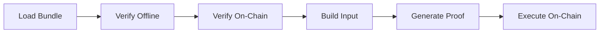
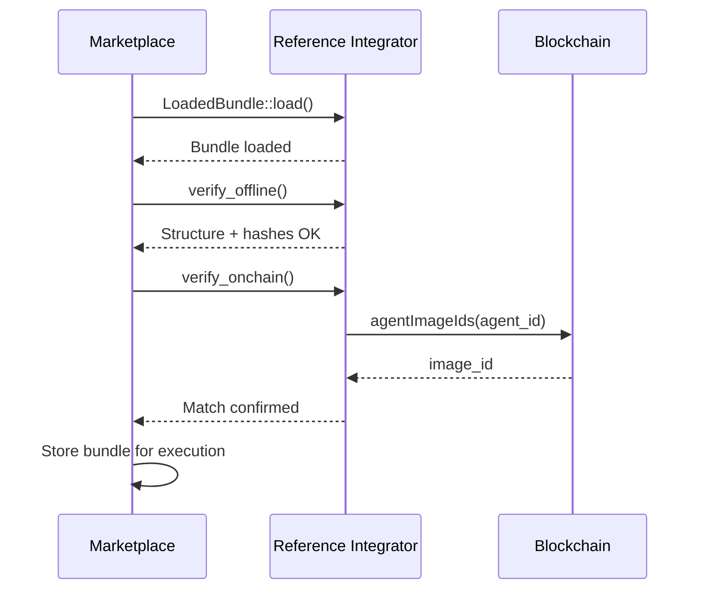

# Reference Integrator

The `reference-integrator` crate provides a complete reference implementation for integrating with Agent Pack bundles. It demonstrates how external marketplaces, backends, and applications can ingest, verify, prove, and execute agents end-to-end.

## What It Does

The reference integrator handles the complete lifecycle of agent execution:

1. **Load Bundle** - Parse the `agent-pack.json` manifest and locate the ELF binary
2. **Verify Offline** - Check manifest structure, validate ELF hash, compute image ID
3. **Verify On-Chain** - Query the KernelExecutionVerifier to confirm registration
4. **Build Input** - Construct the `KernelInputV1` structure with opaque agent inputs
5. **Generate Proof** - Execute the agent in RISC Zero zkVM and produce a Groth16 proof
6. **Execute On-Chain** - Submit the proof and agent output to the KernelVault contract

## Overview



## Installation

Add the crate to your `Cargo.toml`:

```toml
[dependencies]
reference-integrator = { path = "../execution-kernel/crates/reference-integrator" }
```

### Feature Flags

| Feature   | Description                                    | Dependencies              |
|-----------|------------------------------------------------|---------------------------|
| `cli`     | CLI binary (`refint`) (default)                | `clap`                    |
| `onchain` | On-chain verification and execution            | `alloy`, `tokio`          |
| `prove`   | Proof generation with RISC Zero zkVM           | `risc0-zkvm`              |
| `full`    | All features enabled                           | All of the above          |

Example with all features:

```toml
[dependencies]
reference-integrator = { path = "...", features = ["full"] }
```

## Library API

### Loading Bundles

```rust
use reference_integrator::LoadedBundle;

// Load a bundle from a directory
let bundle = LoadedBundle::load("./my-agent-bundle")?;

// Access manifest data
println!("Agent: {} v{}",
    bundle.manifest.agent_name,
    bundle.manifest.agent_version);
println!("Agent ID: {}", bundle.manifest.agent_id);

// Read the ELF binary
let elf_bytes = bundle.read_elf()?;

// Parse hex values to bytes
let agent_id_bytes: [u8; 32] = bundle.agent_id_bytes()?;
let image_id_bytes: [u8; 32] = bundle.image_id_bytes()?;
```

### Offline Verification

```rust
use reference_integrator::{verify_offline, verify_structure};

// Full verification (structure + file hashes)
let result = verify_offline(&bundle);
if result.passed {
    println!("Bundle verified successfully");
} else {
    for error in &result.report.errors {
        eprintln!("Error: {}", error);
    }
}

// Quick structure-only verification
let result = verify_structure(&bundle);
```

### On-Chain Verification

Requires the `onchain` feature.

```rust
use reference_integrator::verify_onchain;

let result = verify_onchain(
    &bundle,
    "https://sepolia.infura.io/v3/YOUR_KEY",
    "0x9Ef5bAB590AFdE8036D57b89ccD2947D4E3b1EFA",
).await?;

match result {
    OnchainVerificationResult::Match => {
        println!("Image ID matches on-chain registry");
    }
    OnchainVerificationResult::Mismatch { onchain, manifest } => {
        eprintln!("Mismatch: on-chain={}, manifest={}", onchain, manifest);
    }
    OnchainVerificationResult::NotRegistered => {
        eprintln!("Agent not registered on-chain");
    }
}
```

### Building Kernel Inputs

```rust
use reference_integrator::{build_kernel_input, build_and_encode_input, InputParams};

// Define execution parameters
let params = InputParams {
    constraint_set_hash: [0u8; 32],
    input_root: [0u8; 32],
    execution_nonce: 1,
    opaque_agent_inputs: b"your agent input data".to_vec(),
};

// Build a KernelInputV1 struct
let input = build_kernel_input(&bundle, &params)?;

// Or build and encode to bytes in one step
let input_bytes = build_and_encode_input(&bundle, &params)?;
```

### Proof Generation

Requires the `prove` feature.

```rust
use reference_integrator::{prove, ProvingMode};

let elf_bytes = bundle.read_elf()?;
let input_bytes = build_and_encode_input(&bundle, &params)?;

// Generate a Groth16 proof (suitable for on-chain verification)
let result = prove(&elf_bytes, &input_bytes, ProvingMode::Groth16)?;

println!("Journal: {} bytes", result.journal_bytes.len());
println!("Seal: {} bytes", result.seal_bytes.len());

// For development/testing, use Dev mode (faster but not on-chain verifiable)
let result = prove(&elf_bytes, &input_bytes, ProvingMode::Dev)?;
```

### On-Chain Execution

Requires the `onchain` feature.

```rust
use reference_integrator::execute_onchain;

let tx_hash = execute_onchain(
    "https://sepolia.infura.io/v3/YOUR_KEY",
    "0xAdeDA97D2D07C7f2e332fD58F40Eb4f7F0192be7",  // KernelVault
    "YOUR_PRIVATE_KEY",
    &journal_bytes,
    &seal_bytes,
    &agent_output_bytes,
).await?;

println!("Transaction: {}", tx_hash);
```

### Agent Output Reconstruction

For on-chain execution, the vault contract requires the raw agent output bytes (not just the commitment). The kernel only outputs the journal containing the action commitment (`sha256(agent_output_bytes)`), so you need to provide the original agent output.

For the **yield agent**, the reference integrator provides a reconstruction function:

```rust
use reference_integrator::reconstruct_yield_agent_output;

// Opaque inputs format: vault (20 bytes) + yield_source (20 bytes) + amount (8 bytes LE)
let opaque_inputs = [
    vault_address.as_slice(),      // 20 bytes
    yield_source.as_slice(),       // 20 bytes
    &amount.to_le_bytes(),         // 8 bytes (u64 little-endian)
].concat();

// Reconstruct the agent output from inputs
let agent_output_bytes = reconstruct_yield_agent_output(&opaque_inputs)?;

// The vault will verify: sha256(agent_output_bytes) == action_commitment
```

The yield agent produces two `CALL` actions:
1. **Deposit**: `call{value: amount}("")` to the yield source contract
2. **Withdraw**: `call{value: 0}(withdraw(vault))` to the yield source contract

For other agents, you must implement your own reconstruction logic or capture the output during proof generation.

## CLI Usage

The `refint` CLI provides command-line access to all functionality.

### Build the CLI

```bash
# Default (CLI only)
cargo build -p reference-integrator --release

# With on-chain features
cargo build -p reference-integrator --release --features onchain

# With proving
cargo build -p reference-integrator --release --features prove

# Full features
cargo build -p reference-integrator --release --features full
```

### Commands

#### verify

Verify a bundle offline (structure and file hashes).

```bash
refint verify ./my-agent-bundle

# Structure-only (skip file hash verification)
refint verify ./my-agent-bundle --structure-only

# On-chain verification (requires --features onchain)
refint verify ./my-agent-bundle --onchain \
  --rpc https://sepolia.infura.io/v3/YOUR_KEY \
  --verifier 0x9Ef5bAB590AFdE8036D57b89ccD2947D4E3b1EFA
```

#### prove

Generate a proof of kernel execution (requires `--features prove`).

```bash
# Basic usage with hex input
refint prove --bundle ./my-agent-bundle \
  --opaque-inputs "0x1234..." \
  --nonce 1 \
  --out ./output

# Read opaque inputs from file (prefix with @)
refint prove --bundle ./my-agent-bundle \
  --opaque-inputs @./inputs.bin \
  --nonce 1 \
  --out ./output

# Development mode (faster, not on-chain verifiable)
refint prove --bundle ./my-agent-bundle \
  --opaque-inputs "0x1234..." \
  --nonce 1 \
  --out ./output \
  --dev

# With all input parameters
refint prove --bundle ./my-agent-bundle \
  --constraint-set-hash 0x... \
  --input-root 0x... \
  --opaque-inputs "0x..." \
  --nonce 1 \
  --out ./output
```

**Parameters:**
- `--opaque-inputs` - Agent-specific input bytes (hex string or `@file_path`)
- `--nonce` - Execution nonce for replay protection (must be monotonically increasing)
- `--out` - Output directory for proof artifacts
- `--dev` - Use development mode (faster but not on-chain verifiable)
- `--json` - Output results in JSON format

**Output files:**
- `journal.bin` - The execution journal (209 bytes) containing commitments and status
- `seal.bin` - The Groth16 proof seal (or dev-mode placeholder)
- `agent_output.bin` - The reconstructed agent output (for yield agent)

#### execute

Execute a proof on-chain via the KernelVault (requires `--features onchain`).

```bash
refint execute --bundle ./my-agent-bundle \
  --rpc https://sepolia.infura.io/v3/YOUR_KEY \
  --vault 0xAdeDA97D2D07C7f2e332fD58F40Eb4f7F0192be7 \
  --pk env:PRIVATE_KEY \
  --journal ./output/journal.bin \
  --seal ./output/seal.bin \
  --agent-output ./output/agent_output.bin
```

**Parameters:**
- `--bundle` - Path to the Agent Pack bundle directory
- `--rpc` - Ethereum RPC endpoint URL
- `--vault` - KernelVault contract address
- `--pk` - Private key (`env:VAR_NAME` or raw hex)
- `--journal` - Path to `journal.bin` from proof generation
- `--seal` - Path to `seal.bin` from proof generation
- `--agent-output` - Path to `agent_output.bin` containing agent actions

**Private key formats:**
- `env:PRIVATE_KEY` - Read from environment variable (recommended)
- `0x...` - Raw hex string (not recommended, appears in shell history)

**What happens on-chain:**
1. The vault calls the RISC Zero Verifier Router to verify the proof
2. The vault checks `sha256(agent_output_bytes) == action_commitment` from the journal
3. If verification passes, the vault executes each action in the agent output

#### status

Show feature availability status.

```bash
refint status
```

Output:
```
reference-integrator v0.1.0

Feature Status:
  CLI:           enabled
  On-chain:      enabled (compile with --features onchain)
  Proving:       disabled (compile with --features prove)
```

### Exit Codes

| Code | Meaning                                      |
|------|----------------------------------------------|
| 0    | Success                                      |
| 1    | Error (invalid input, file not found, etc.)  |
| 2    | Verification failed (hash mismatch, etc.)    |
| 3    | On-chain: agent not registered               |

## Complete Workflow Example

Here's a complete example of ingesting, verifying, proving, and executing an agent:

```rust
use reference_integrator::*;

async fn process_agent_bundle(
    bundle_path: &str
) -> Result<String, Box<dyn std::error::Error>> {
    // 1. Load the bundle
    let bundle = LoadedBundle::load(bundle_path)?;
    println!("Loaded: {} v{}",
        bundle.manifest.agent_name,
        bundle.manifest.agent_version);

    // 2. Verify offline
    let offline_result = verify_offline(&bundle);
    if !offline_result.passed {
        return Err("Offline verification failed".into());
    }

    // 3. Verify on-chain registration
    let onchain_result = verify_onchain(
        &bundle,
        "https://sepolia.infura.io/v3/YOUR_KEY",
        "0x9Ef5bAB590AFdE8036D57b89ccD2947D4E3b1EFA",
    ).await?;

    match onchain_result {
        OnchainVerificationResult::Match => {},
        _ => return Err("On-chain verification failed".into()),
    }

    // 4. Build kernel input
    let params = InputParams {
        opaque_agent_inputs: b"market data here".to_vec(),
        ..Default::default()
    };
    let input_bytes = build_and_encode_input(&bundle, &params)?;

    // 5. Generate proof
    let elf_bytes = bundle.read_elf()?;
    let prove_result = prove(
        &elf_bytes,
        &input_bytes,
        ProvingMode::Groth16
    )?;

    // 6. Execute on-chain
    let tx_hash = execute_onchain(
        "https://sepolia.infura.io/v3/YOUR_KEY",
        "0xAdeDA97D2D07C7f2e332fD58F40Eb4f7F0192be7",
        std::env::var("PRIVATE_KEY")?.as_str(),
        &prove_result.journal_bytes,
        &prove_result.seal_bytes,
        &prove_result.journal.agent_output.actions_bytes,
    ).await?;

    Ok(tx_hash)
}
```

## Marketplace Integration

For marketplaces accepting agent submissions:



### CI/CD Pipeline

```bash
#!/bin/bash
set -e

# Verify bundle completely
refint verify ./submission --onchain \
  --rpc $RPC_URL \
  --verifier $VERIFIER_ADDRESS

# Exit code 0 = accept, non-zero = reject
echo "Bundle verified successfully"
```

## Contract Addresses (Sepolia)

| Contract                  | Address                                      |
|---------------------------|----------------------------------------------|
| KernelExecutionVerifier   | `0x9Ef5bAB590AFdE8036D57b89ccD2947D4E3b1EFA` |
| KernelVault               | `0xAdeDA97D2D07C7f2e332fD58F40Eb4f7F0192be7` |
| RISC Zero Verifier Router | `0x925d8331ddc0a1F0d96E68CF073DFE1d92b69187` |

## Error Handling

All public functions return `Result` types with descriptive errors:

```rust
use reference_integrator::{BundleError, VerifyError, InputError, ProveError};

match LoadedBundle::load("./bundle") {
    Ok(bundle) => { /* ... */ }
    Err(BundleError::DirectoryNotFound(path)) => {
        eprintln!("Bundle directory not found: {}", path.display());
    }
    Err(BundleError::ManifestNotFound(path)) => {
        eprintln!("Missing agent-pack.json at: {}", path.display());
    }
    Err(BundleError::ElfNotFound(path)) => {
        eprintln!("ELF file not found: {}", path.display());
    }
    Err(e) => eprintln!("Error: {}", e),
}
```

## Testing

Run the test suite:

```bash
# Unit tests
cargo test -p reference-integrator

# With all features
cargo test -p reference-integrator --features full
```

## Related

- [Golden Path Demo](/integration/golden-path) - End-to-end walkthrough
- [Agent Pack Format](/agent-pack/format) - Bundle structure
- [Agent Pack Verification](/agent-pack/verification) - Verification details
- [On-Chain Verifier](/onchain/verifier-overview) - Contract details
