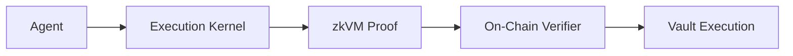

# Execution Kernel

The Execution Kernel is a **consensus-critical, deterministic agent execution framework** for RISC Zero zkVM. It enables verifiable DeFi ML agents that make capital allocation decisions with cryptographic proof of correct execution.

## Quick Navigation

| If you want to... | Start here |
|-------------------|------------|
| **Understand how it works** | [Architecture Overview](/architecture/overview) |
| **Build an agent** | [Writing an Agent](/sdk/writing-an-agent) |
| **Set up your dev environment** | [Prerequisites](/getting-started/prerequisites) |
| **Integrate with smart contracts** | [On-Chain Verification](/onchain/verifier-overview) |
| **Understand the binary formats** | [Input Format](/kernel/input-format) |
| **Package an agent for deployment** | [Agent Pack Format](/agent-pack/format) |
| **Audit or review the codebase** | [Repository Map](/reference/repo-map) |

## What is the Execution Kernel?

The Execution Kernel defines what constitutes a **valid agent execution** through zero-knowledge proofs. Capital is held in on-chain vaults that delegate decision-making to agents—programs that analyze market conditions and produce actions like deposits, withdrawals, or trades.



The kernel acts as a **verifiable sandbox**: an agent runs inside the kernel, which runs inside a zkVM. The zkVM produces a proof that:

- The agent executed correctly according to its own code
- The kernel enforced all protocol constraints
- The resulting actions are exactly what the agent decided

## Key Features

### Agent-Agnostic Design

The kernel uses trait-based dependency injection, allowing new agents without modifying kernel code:

```rust
pub trait AgentEntrypoint {
    fn code_hash(&self) -> [u8; 32];
    fn run(&self, ctx: &AgentContext, opaque_inputs: &[u8]) -> AgentOutput;
}

// Execute kernel with any agent
let journal = kernel_main_with_agent(&input_bytes, &MyAgent)?;
```

### Cryptographic Commitments

Every execution produces a journal containing:

- **Input commitment**: SHA-256 hash of all inputs
- **Action commitment**: SHA-256 hash of all outputs
- **Execution status**: Success or Failure

### Constraint Enforcement

The constraint engine validates agent outputs against safety rules:
- Position size limits
- Leverage bounds
- Asset whitelists
- Cooldown periods

## Protocol Constants

| Constant | Value | Description |
|----------|-------|-------------|
| `PROTOCOL_VERSION` | 1 | Wire format version |
| `KERNEL_VERSION` | 1 | Kernel semantics version |
| `MAX_AGENT_INPUT_BYTES` | 64,000 | Maximum input size |
| `MAX_AGENT_OUTPUT_BYTES` | 64,000 | Maximum output size |
| `MAX_ACTIONS_PER_OUTPUT` | 64 | Maximum actions per execution |
| `MAX_ACTION_PAYLOAD_BYTES` | 16,384 | Maximum payload per action |
| `HASH_FUNCTION` | SHA-256 | Commitment hash function |

:::tip Where in the code?
These constants are defined in [`kernel-core/src/lib.rs`](https://github.com/Defiesta/execution-kernel/blob/main/crates/protocol/kernel-core/src/lib.rs) and [`kernel-core/src/types.rs`](https://github.com/Defiesta/execution-kernel/blob/main/crates/protocol/kernel-core/src/types.rs).
:::

## On-Chain Deployment (Sepolia)

| Contract | Address |
|----------|---------|
| AgentRegistry | [`0xBa1DA5f7e12F2c8614696D019A2eb48918E1f2AA`](https://sepolia.etherscan.io/address/0xBa1DA5f7e12F2c8614696D019A2eb48918E1f2AA) |
| VaultFactory | [`0x3bB48a146bBC50F8990c86787a41185A6fC474d2`](https://sepolia.etherscan.io/address/0x3bB48a146bBC50F8990c86787a41185A6fC474d2) |
| KernelExecutionVerifier | [`0x9Ef5bAB590AFdE8036D57b89ccD2947D4E3b1EFA`](https://sepolia.etherscan.io/address/0x9Ef5bAB590AFdE8036D57b89ccD2947D4E3b1EFA) |
| RISC Zero Verifier Router | [`0x925d8331ddc0a1F0d96E68CF073DFE1d92b69187`](https://sepolia.etherscan.io/address/0x925d8331ddc0a1F0d96E68CF073DFE1d92b69187) |

The system is **fully permissionless**: anyone can register agents via `AgentRegistry` and deploy vaults via `VaultFactory`. See [Permissionless System](/onchain/permissionless-system) for details.

## Quick Start

```bash
# Clone the repository
git clone https://github.com/Defiesta/execution-kernel.git
cd execution-kernel

# Run tests
cargo test

# Build with zkVM support
cargo build --release --features risc0
```

## Next Steps

- [Architecture Overview](/architecture/overview) - Understand the system design
- [Prerequisites](/getting-started/prerequisites) - Set up your development environment
- [Writing an Agent](/sdk/writing-an-agent) - Build your first agent
