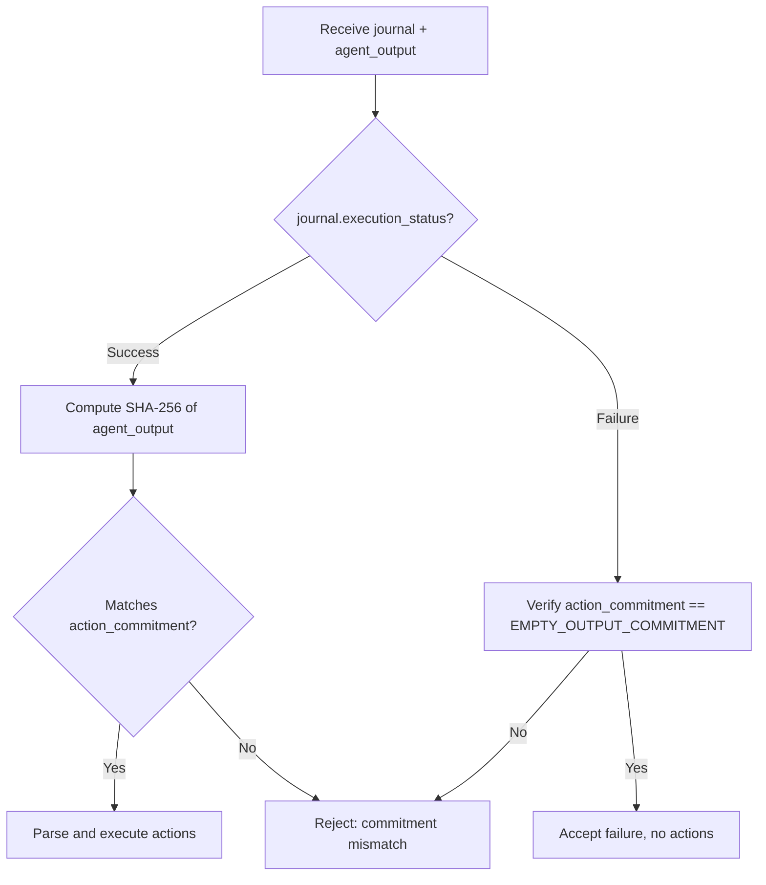

# KernelJournalV1 Format

The `KernelJournalV1` structure is the public output of a kernel execution. It's committed to the zkVM proof and parsed on-chain.

## Structure Definition

```rust
pub struct KernelJournalV1 {
    pub protocol_version: u32,
    pub kernel_version: u32,
    pub agent_id: [u8; 32],
    pub agent_code_hash: [u8; 32],
    pub constraint_set_hash: [u8; 32],
    pub input_root: [u8; 32],
    pub execution_nonce: u64,
    pub input_commitment: [u8; 32],
    pub action_commitment: [u8; 32],
    pub execution_status: ExecutionStatus,
}
```

:::tip Where in the code?
- **Type definition**: [`kernel-core/src/types.rs:40`](https://github.com/Defiesta/execution-kernel/blob/main/crates/protocol/kernel-core/src/types.rs#L40) — `KernelJournalV1` struct
- **ExecutionStatus enum**: [`kernel-core/src/types.rs:78`](https://github.com/Defiesta/execution-kernel/blob/main/crates/protocol/kernel-core/src/types.rs#L78) — Success/Failure encoding
- **Journal production**: [`kernel-guest/src/lib.rs`](https://github.com/Defiesta/execution-kernel/blob/main/crates/runtime/kernel-guest/src/lib.rs) — `kernel_main_with_agent()` function
- **On-chain parsing**: [`contracts/src/libraries/KernelOutputParser.sol`](https://github.com/Defiesta/execution-kernel/blob/main/contracts/src/libraries/KernelOutputParser.sol) — Solidity library
:::

## Binary Layout

Fixed size: **209 bytes**

```
Offset │ Field                 │ Type            │ Size
───────┼───────────────────────┼─────────────────┼──────
0      │ protocol_version      │ u32             │ 4
4      │ kernel_version        │ u32             │ 4
8      │ agent_id              │ [u8; 32]        │ 32
40     │ agent_code_hash       │ [u8; 32]        │ 32
72     │ constraint_set_hash   │ [u8; 32]        │ 32
104    │ input_root            │ [u8; 32]        │ 32
136    │ execution_nonce       │ u64             │ 8
144    │ input_commitment      │ [u8; 32]        │ 32
176    │ action_commitment     │ [u8; 32]        │ 32
208    │ execution_status      │ ExecutionStatus │ 1
```

## Field Descriptions

### Identity Fields (Copied from Input)

The following fields are copied directly from `KernelInputV1`:

- `protocol_version` - Wire format version
- `kernel_version` - Kernel semantics version
- `agent_id` - Agent identifier
- `agent_code_hash` - Agent code hash
- `constraint_set_hash` - Constraint set hash
- `input_root` - External state root
- `execution_nonce` - Replay protection counter

### input_commitment ([u8; 32])

SHA-256 hash of the raw encoded `KernelInputV1` bytes.

```rust
input_commitment = SHA-256(input.encode())
```

This binds the proof to specific inputs without revealing them on-chain.

### action_commitment ([u8; 32])

SHA-256 hash of the encoded `AgentOutput`.

For successful executions:
```rust
action_commitment = SHA-256(agent_output.encode())
```

For failed executions (constraint violations):
```rust
action_commitment = SHA-256([0x00, 0x00, 0x00, 0x00])  // Empty output
                  = df3f619804a92fdb4057192dc43dd748ea778adc52bc498ce80524c014b81119
```

### execution_status (ExecutionStatus)

Single byte indicating execution result:

| Value | Name | Description |
|-------|------|-------------|
| `0x00` | Reserved | Invalid (catches uninitialized memory) |
| `0x01` | `Success` | Execution completed, all constraints passed |
| `0x02` | `Failure` | Execution completed, constraints violated |
| `0x03-0xFF` | Reserved | Reserved for future use |

## ExecutionStatus

```rust
#[repr(u8)]
pub enum ExecutionStatus {
    Success = 0x01,
    Failure = 0x02,
}
```

### Design Rationale

- `0x00` is deliberately invalid to catch uninitialized memory bugs
- `0x01` for Success follows boolean conventions (1 = true = success)
- `0x02` for Failure distinguishes constraint violations from panics/aborts

## Decoding Example

```rust
use kernel_core::*;

let journal_bytes: &[u8] = /* from zkVM receipt */;
let journal = KernelJournalV1::decode(journal_bytes)?;

match journal.execution_status {
    ExecutionStatus::Success => {
        println!("Execution succeeded!");
        println!("Action commitment: {:?}", journal.action_commitment);
    }
    ExecutionStatus::Failure => {
        println!("Execution failed (constraint violation)");
        // action_commitment is EMPTY_OUTPUT_COMMITMENT
    }
}
```

## On-Chain Parsing

In Solidity, the journal is parsed using the `KernelOutputParser` library:

```solidity
library KernelOutputParser {
    struct ParsedJournal {
        uint32 protocolVersion;
        uint32 kernelVersion;
        bytes32 agentId;
        bytes32 agentCodeHash;
        bytes32 constraintSetHash;
        bytes32 inputRoot;
        uint64 executionNonce;
        bytes32 inputCommitment;
        bytes32 actionCommitment;
        uint8 executionStatus;
    }

    function parse(bytes calldata journal) internal pure returns (ParsedJournal memory) {
        require(journal.length == 209, "Invalid journal length");
        // Parse fields at known offsets...
    }
}
```

## Validation Rules

| Rule | Error |
|------|-------|
| `protocol_version == 1` | `InvalidVersion` |
| `kernel_version == 1` | `InvalidVersion` |
| `execution_status in {0x01, 0x02}` | `InvalidExecutionStatus` |
| Total bytes == 209 | `InvalidLength` |

## Empty Output Commitment

When constraints are violated:

```rust
empty_output = AgentOutput { actions: vec![] }
empty_encoded = encode(empty_output)  // = [0x00, 0x00, 0x00, 0x00]
action_commitment = SHA-256(empty_encoded)
```

The constant empty output commitment is:

```
df3f619804a92fdb4057192dc43dd748ea778adc52bc498ce80524c014b81119
```

This well-known value allows on-chain contracts to easily detect failure cases.

## Verification Flow



## Related

- [Input Format](/kernel/input-format) - Input structure
- [Versioning](/kernel/versioning) - Protocol and kernel versions
- [On-Chain Verification](/onchain/verifier-overview) - Solidity integration
