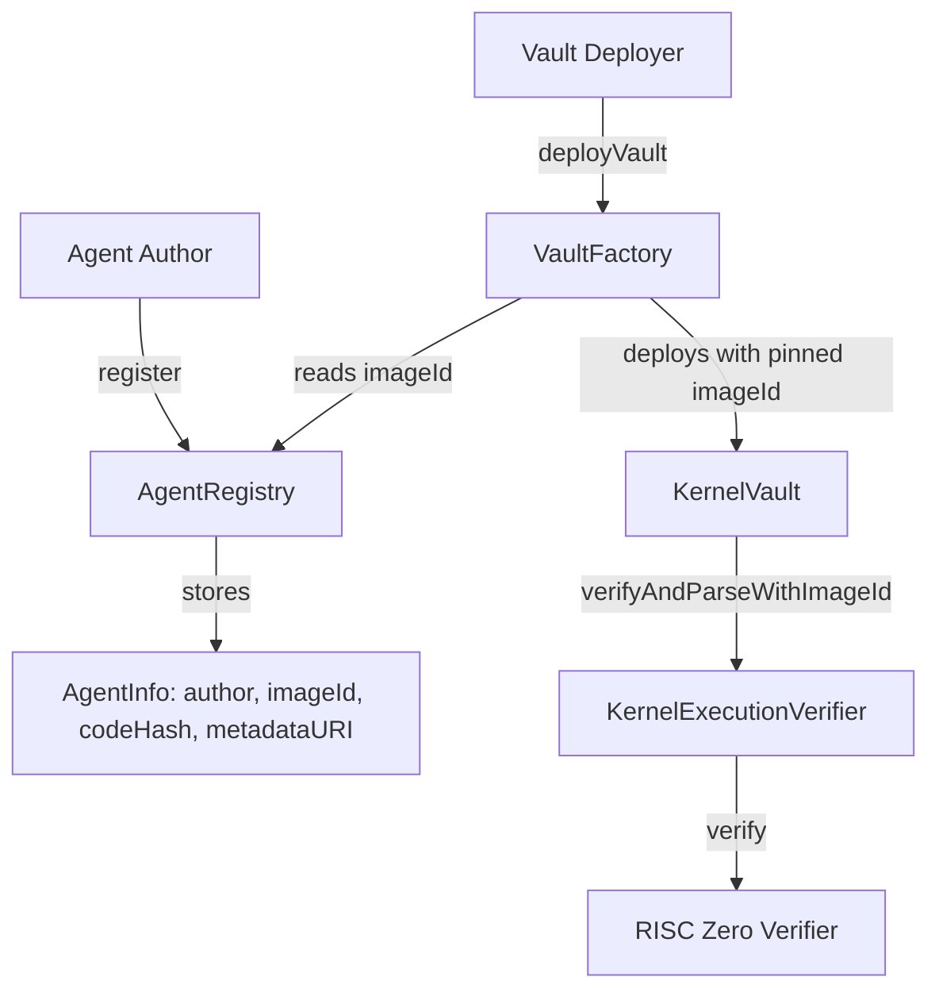
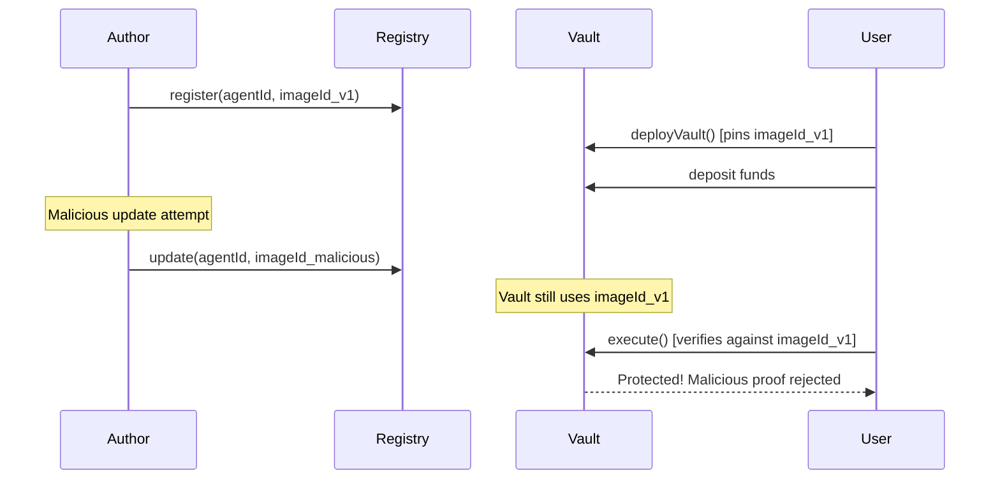

# Permissionless Agent Registry & Vault Factory

This document describes the permissionless system for agent registration and vault deployment, introduced to enable trustless and decentralized agent management.

## Overview

The permissionless system consists of two core components:

1. **AgentRegistry**: Permissionless registration of agents with deterministic IDs
2. **VaultFactory**: CREATE2-based vault deployment with imageId pinning

This design removes the need for a trusted operator to register agents, enabling anyone to deploy and run agents in a fully decentralized manner.

## Deployed Contracts (Sepolia)

| Contract | Address |
|----------|---------|
| AgentRegistry | [`0xBa1DA5f7e12F2c8614696D019A2eb48918E1f2AA`](https://sepolia.etherscan.io/address/0xBa1DA5f7e12F2c8614696D019A2eb48918E1f2AA) |
| VaultFactory | [`0x3bB48a146bBC50F8990c86787a41185A6fC474d2`](https://sepolia.etherscan.io/address/0x3bB48a146bBC50F8990c86787a41185A6fC474d2) |
| KernelExecutionVerifier | [`0x9Ef5bAB590AFdE8036D57b89ccD2947D4E3b1EFA`](https://sepolia.etherscan.io/address/0x9Ef5bAB590AFdE8036D57b89ccD2947D4E3b1EFA) |
| RISC Zero Verifier Router | [`0x925d8331ddc0a1F0d96E68CF073DFE1d92b69187`](https://sepolia.etherscan.io/address/0x925d8331ddc0a1F0d96E68CF073DFE1d92b69187) |

## Architecture



## Deterministic Agent ID

Agent IDs are computed deterministically from the author's address and a salt:

```solidity
agentId = keccak256(abi.encodePacked(author, salt))
```

This ensures:
- **Author-bound**: Only the original author can update agent configuration
- **Collision-free**: Different authors with same salt produce different IDs
- **Predictable**: Agent ID can be computed before registration

## ImageId Pinning

A critical security property: **imageId is pinned at vault deployment time**.

```
At Deployment:
  VaultFactory.deployVault(agentId, asset, salt)
  → reads AgentRegistry.get(agentId).imageId
  → deploys KernelVault with trustedImageId = imageId (immutable)

At Execution:
  Vault.execute(journal, seal, agentOutput)
  → calls verifier.verifyAndParseWithImageId(trustedImageId, ...)
  → RISC Zero verifies proof against pinned imageId
```

### Why Pinning Matters

If the vault looked up `imageId` from the registry at execution time, a malicious author could:
1. Register a legitimate agent
2. Wait for users to deposit funds
3. Update the registry to point to a malicious agent
4. Execute the malicious agent and drain funds

By pinning `imageId` at deployment, vaults are **immutable** to registry changes. Users know exactly what agent code will be executed.

## Upgrade Policy

Since `trustedImageId` is immutable, upgrading an agent requires:

1. Author updates registry with new imageId
2. Users deploy NEW vaults via VaultFactory
3. Users migrate funds from old vault to new vault

Existing vaults continue operating with their pinned imageId indefinitely.

## Contract Interfaces

### IAgentRegistry

```solidity
interface IAgentRegistry {
    struct AgentInfo {
        address author;
        bytes32 imageId;
        bytes32 agentCodeHash;
        string metadataURI;
        bool exists;
    }

    function computeAgentId(address author, bytes32 salt) external pure returns (bytes32);
    function register(bytes32 salt, bytes32 imageId, bytes32 agentCodeHash, string calldata metadataURI) external returns (bytes32);
    function update(bytes32 agentId, bytes32 newImageId, bytes32 newAgentCodeHash, string calldata newMetadataURI) external;
    function get(bytes32 agentId) external view returns (AgentInfo memory);
    function agentExists(bytes32 agentId) external view returns (bool);
}
```

### IVaultFactory

```solidity
interface IVaultFactory {
    function computeVaultAddress(address owner, bytes32 agentId, address asset, bytes32 userSalt) external view returns (address, bytes32);
    function deployVault(bytes32 agentId, address asset, bytes32 userSalt) external returns (address);
    function registry() external view returns (address);
    function verifier() external view returns (address);
    function isDeployedVault(address vault) external view returns (bool);
}
```

### verifyAndParseWithImageId

```solidity
function verifyAndParseWithImageId(
    bytes32 expectedImageId,
    bytes calldata journal,
    bytes calldata seal
) external view returns (ParsedJournal memory);
```

Unlike `verifyAndParse`, this method does NOT look up imageId from internal mappings. The vault provides its pinned `trustedImageId`, enabling permissionless verification.

## Security Considerations

### Invariants Maintained

- **agentId binding**: Vault is bound to a specific agentId (unchanged)
- **Nonce replay protection**: Nonces must be strictly increasing (unchanged)
- **action_commitment binding**: Actions match committed hash (unchanged)
- **Atomic execution**: All-or-nothing action execution (unchanged)
- **NEW: imageId pinning**: Vault's imageId is immutable after deployment

### Trust Model

| Party | Trust Level | Actions |
|-------|-------------|---------|
| Agent Author | Untrusted | Can only update registry (not existing vaults) |
| Vault Deployer | Untrusted | Can only deploy vaults, not modify them |
| Registry | Trusted for initial imageId lookup | Immutable after vault deployment |
| Vault | Trusted with deposited funds | Executes only verified proofs |

### Registry Update Attack Prevention



## Usage Examples

### Registering an Agent

```solidity
// Deploy your agent and get the imageId from RISC Zero build
bytes32 imageId = 0x1234...;
bytes32 agentCodeHash = 0xabcd...;

// Register with any unique salt
bytes32 salt = keccak256("my-agent-v1");
bytes32 agentId = registry.register(salt, imageId, agentCodeHash, "ipfs://QmMetadata");
```

### Deploying a Vault

```solidity
// Compute address first (optional, for pre-funding)
(address vaultAddr, ) = factory.computeVaultAddress(
    msg.sender,
    agentId,
    address(usdc),
    bytes32(0) // user salt
);

// Deploy vault
address vault = factory.deployVault(agentId, address(usdc), bytes32(0));

// Deposit and use
KernelVault(payable(vault)).depositERC20Tokens(1000e6);
```

### Upgrading to New Agent Version

```solidity
// Author releases new version
bytes32 newImageId = 0x5678...;
registry.update(agentId, newImageId, newCodeHash, "ipfs://QmNewMetadata");

// Users deploy new vaults with updated imageId
address newVault = factory.deployVault(agentId, address(usdc), bytes32(uint256(1)));

// Migrate funds from old vault
oldVault.withdraw(oldVault.shares(msg.sender));
newVault.depositERC20Tokens(amount);
```

## Comparison: Before and After

| Aspect | Before (Owner-controlled) | After (Permissionless) |
|--------|---------------------------|------------------------|
| Agent Registration | Owner only | Anyone |
| Vault Deployment | Manual | Factory + CREATE2 |
| ImageId Source | Registry lookup at execute | Pinned at deployment |
| Upgrade Path | Owner updates registry | Deploy new vault, migrate funds |
| Trust Requirement | Trust owner | Trust only your vault's pinned imageId |
